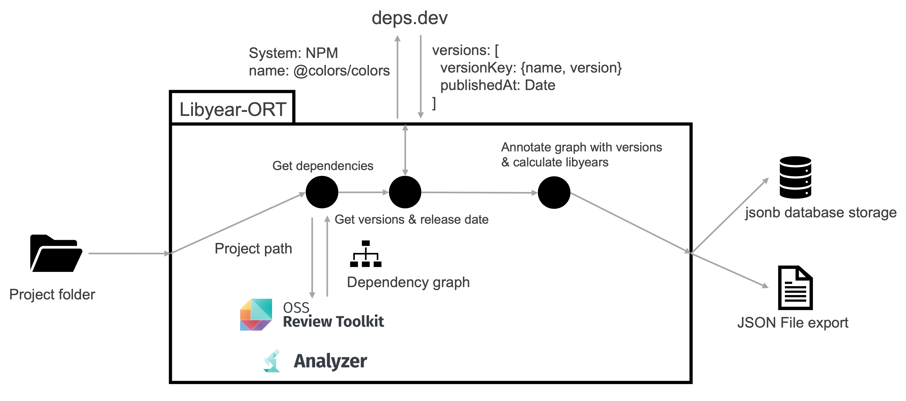

# Technical Lag Calculator

This CLI tool calculates a project's libyear[1] score. The libyear score describes the age of a 
software's dependencies by measuring the difference between the release date of the newest version
and the currently used version. Further, we calculate additional information like the release distance, 
number of missed releases, release frequency, and more. \
Our tool uses the ORT[2] to get a list of all used dependencies in the analyzed project and deps.dev to 
retrieve further information about the analyzed dependencies. Therefore,
we theoretically support all ecosystems currently implemented in the ORT and deps.dev. 

### Usage

Import the project to IntelliJ as a gradle project and add a custom run configuration.

For manual use run `./gradlew run` to get a list of all available commands. Run `./gradlew run --args "{{COMMAND_NAME}} --help"` to 
get usage instructions.

To run the technical lag calculator you can either use the included `Dockerfile` or build it using 
`./gradlew installDist` and then run the resulting artifact with `./build/install/libyear-ort/bin/technical-lag-calculator`.
### Display results

The tool results are created in the provided output folder. The results contain a visualization of the output in the 
form of an HTML report. To display the report locally you need to start a local webserver (e.g. by running `python3 -m http.server`) in the folder containing the 
files and access the URL (e.g., `localhost:8000/htmlReport.html`).

### Architecture overview

### Maintainer
* Jan-Niclas Strüwer

---
[1] J. Cox, E. Bouwers, M. van Eekelen and J. Visser, Measuring Dependency Freshness in Software
Systems. In Proceedings of the 37th International Conference on Software Engineering (ICSE 2015),
May 2015 https://ericbouwers.github.io/papers/icse15.pdf \
[2] https://github.com/oss-review-toolkit/ort
